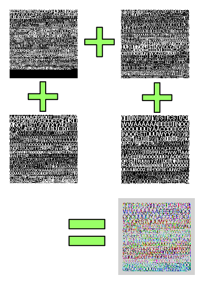
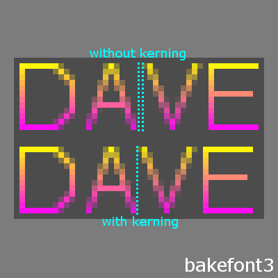
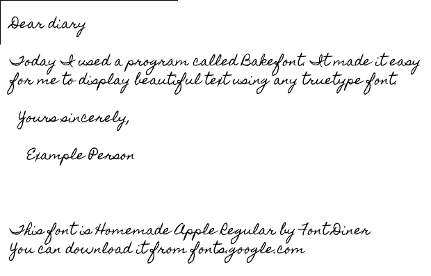
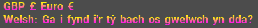

# bakefont3 #

*bakefont3* is a python3 module for rasterising font glyphs into a RGBA texture
atlas and exporting metrics and kerning information, and a C library for
loading that information.

**Pack glyphs efficiently into a texture atlas**  
(using example-generate.py)

**Make use of kerning information**  
(based on example-gl.c)

**Use any beautiful truetype font you want**  
(realtime rendering using example-gl.c)

**Support any language and locale with full unicode support**  
(realtime rendering using example-gl.c; depends on font support)

## Features ##

* Unicode support
* customisable character ranges
* exports font metrics and kerning data as binary optimised for quick lookup
* efficient packing to reduce physical texture size
* can use all four colour channels to share space with other textures (can
    export RGBA, RGB, greyscale)
* suitable for efficient real-time rendering using OpenGL shaders
* supports square and rectangle texture atlases of any size
* metrics accurate up to 1/64th of a pixel (e.g. for supersampling)
* small `.c` loader - no heavy dependencies in client software
* pixel-perfect results for even the smallest text

## Limitations ##

* fonts, sizes and styles must be known and generated in advance (slow!)
* for large text, vector graphics are better
* not ideal for rotated text (decent results with supersampling?)
* does not include a layout engine - just exports the metrics that one would use
    (but see example simple layout in `example-gl.c`)
* does not support RGBA glyphs - e.g. full colour emojis (yet)

Bakefont3 does not export vertical kerning information for vertical fonts.
This can easily be fixed - please get in touch if you can help. This isn't
a technical barrier: I just don't know what the correct result looks like
and I don't have any fonts to test with.

## Example Usage ##

### Generate a font atlas / metrics / kerning pairs using bakefont3 ###

A sample script, `example-generate.py`, is provided. You may like to edit it
to select the fonts, sizes and characters to generate.

    $ python3 example-generate.py

This file generates the following files:

    test.bf3
    test-rgba.png
    test-r.png
    test-g.png
    test-b.png
    test-a.png

`test-rgba.png` is a texture atlas containing rasterised glyphs in each colour
channel. The other images show the individual channels, but you don't need them.

`test.bf3` contains information about the fonts used, how to find characters
in the texture atlas, metrics and kerning information for laying out text
on a screen.

### Load files generated by bakefont3 ###

A sample program, `example.c` is provided. You may like to edit it to
change the font data it tries to load.

`bakefont3.h` and `bakefont3.c` are an example interface for loading and
querying bakefont3 data.

    $ # Compile
    $ gcc -std=c99 example.c bakefont3.h bakefont3.c -lm -o example.bin
    # # Run
    $ ./example.bin example/test.bf3 example/test-rgba.png

### Render text with bakefont3 ###

A sample program, `example-gl.c` is provided. You may like to edit it to
change the font data it tries to load.

`bakefont3.h` and `bakefont3.c` are an example interface for loading and
querying bakefont3 data.

    $ # Compile
    $ gcc -std=c99 example-gl.c bakefont3.c lib/png.c lib/gl3w.c lib/utf8.c -lm -lglfw -lGL -lpng -ldl  -Wall -Wextra -o example-gl.bin
    # # Run
    $ ./example-gl.bin example/test.bf3 example/test-rgba.png

## Dependencies ##

### For generating fonts using bakefont3:

* Python3 and modules Pillow, numpy, freetype-py

Example:

    $ sudo apt-get install libfreetype6
    $ sudo pip3 install Pillow numpy freetype-py

### For the Python example program:

* Roboto and Roboto Mono fonts (from [fonts.google.com](https://fonts.google.com/))
* Arial font from Microsoft (search `msttcorefonts`)

### For the C example program:

* Maths: link with `-lm`
* a C compiler (e.g. gcc, clang)

### For the C/OpenGL example program:

* You will also need libpng and libglfw

Example:

    $ sudo apt-get install libglfw3 libglfw3-dev libpng12-0 libpng12-dev

## Useful notes ##

**When talking about font faces and glyphs, what do terms like ascent, descent,
kerning, etc. mean?**

See [1](https://www.microsoft.com/typography/otspec/TTCH01.htm),
[2](https://www.freetype.org/freetype2/docs/tutorial/step2.html),
[3](https://www.freetype.org/freetype2/docs/glyphs/glyphs-3.html),
[4](https://www.freetype.org/freetype2/docs/glyphs/glyphs-4.html)

**Font sizes are given in pixels.**

Typographic dpi is always 72. At 72ppi, 1pt == 1px.
Convert as necessary for different devices.

**What is the "26.6 fixed float" format?**

This encodes a [Real number](https://en.wikipedia.org/wiki/Real_number) as a
signed 32 bit integer. Divide by 64.0 to get the Real value. Or, multiply
a Real value by 64.0 and cast to a signed 32 bit integer to encode it.

One of the reasons these are used is because unlike floats, they compare
precisely - e.g. a font size of 13.5pt can be identified exactly.

(Freetype also has a "2.14 fixed float" format but you don't need to know
anything about this).

**Why use all four colour channels to bake the texture atlas?**

If you are using the texture atlas on its own, you gain nothing by doing this
and may as well just generate the greyscale version (bakefont3 can do that, too).

However, you sometimes want to combine several textures - like the glyphs, GUI
images, game graphics, etc. into one big RGBA texture as an optimisation to
avoid texture switching on the GPU.

For example, you might extend your text rendering code to draw full-colour
icons and emojis aligned with your text in the same batch.

## Copyright Status of Rasterised Glyphs ##

This does depend: copyright law in the U.S protects the font, but not the
typeface. In Europe, the typeface is usually protected.

The safest and most ethical way to handle this is to think of Bakefont3 as
something that creates a derived work. Copyrighted data goes in, copyrighted
data comes out.

That means that the output of a Bakefont3 program should inherit the same
copyright and license as the input. In the case of multiple inputs by different
authors, the output shares all these copyrights and licenses. The licenses
must not conflict.

Most open source fonts share the same one or two permissive licenses
([fonts.google.com](fonts.google.com) is a great place for this), so this
is usually quite simple in practice.

It's also worth knowing that many open source font licenses say that you can't
use the same name for a derived work. Bakefont3 by design makes it easy to use
your own generic names for fonts (it's also fine to say something like
"My Font based on Original Font").

## COPYING ##

Bakefont3 is free and open source software.

Did you publish software that uses Bakefont3? Did it save you time? Did it
add value to your software? If so, please consider 
[supporting the author](https://www.patreon.com/golightlyb).

    bakefont3

    Copyright © 2015 - 2017 Ben Golightly <golightly.ben@googlemail.com>

    Permission is hereby granted, free of charge, to any person obtaining a copy
    of this software and associated documentation files (the "Software"), to deal
    in the Software without restriction,  including without limitation the rights
    to use,  copy, modify,  merge,  publish, distribute, sublicense,  and/or sell
    copies  of  the  Software,  and  to  permit persons  to whom  the Software is
    furnished to do so, subject to the following conditions:

    The above copyright notice  and this permission notice  shall be  included in
    all copies or substantial portions of the Software.

    THE SOFTWARE IS PROVIDED  "AS IS",  WITHOUT WARRANTY OF ANY KIND,  EXPRESS OR
    IMPLIED,  INCLUDING  BUT  NOT LIMITED TO THE WARRANTIES  OF  MERCHANTABILITY,
    FITNESS FOR A PARTICULAR PURPOSE  AND NONINFRINGEMENT.  IN NO EVENT SHALL THE
    AUTHORS  OR COPYRIGHT HOLDERS  BE LIABLE  FOR ANY  CLAIM,  DAMAGES  OR  OTHER
    LIABILITY, WHETHER IN AN ACTION OF CONTRACT, TORT OR OTHERWISE, ARISING FROM,
    OUT OF OR IN CONNECTION WITH THE SOFTWARE OR THE USE OR OTHER DEALINGS IN THE
    SOFTWARE.

